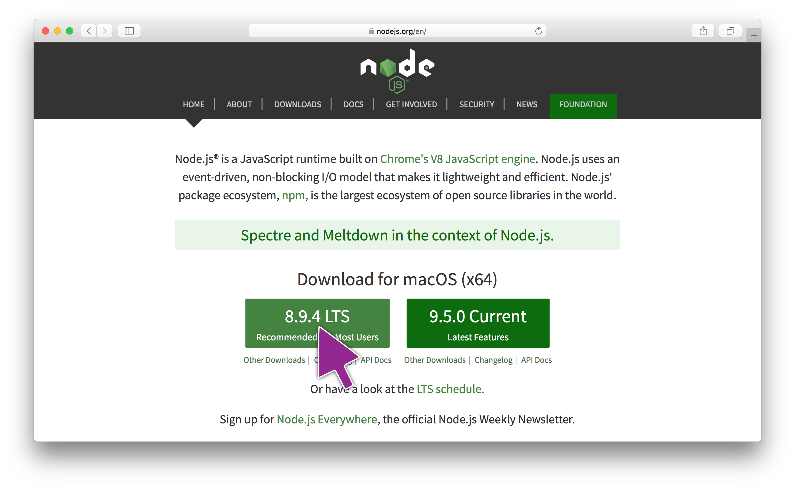
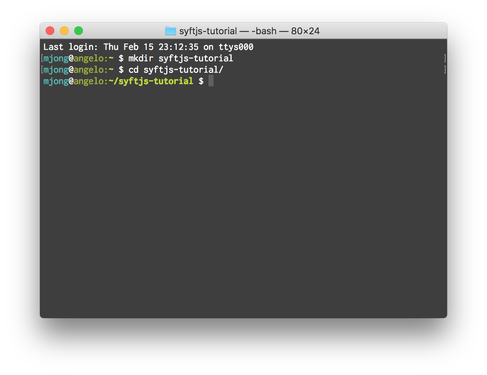
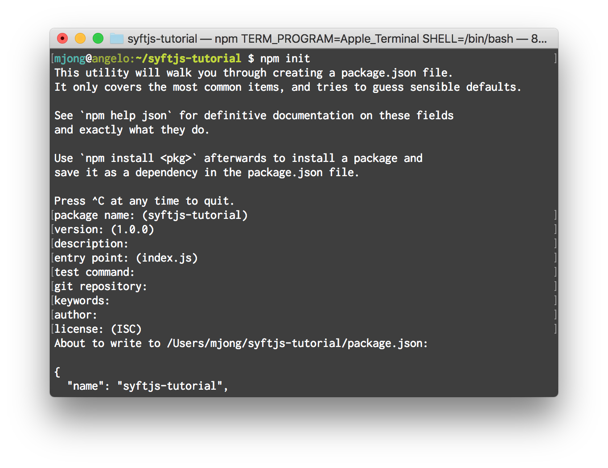
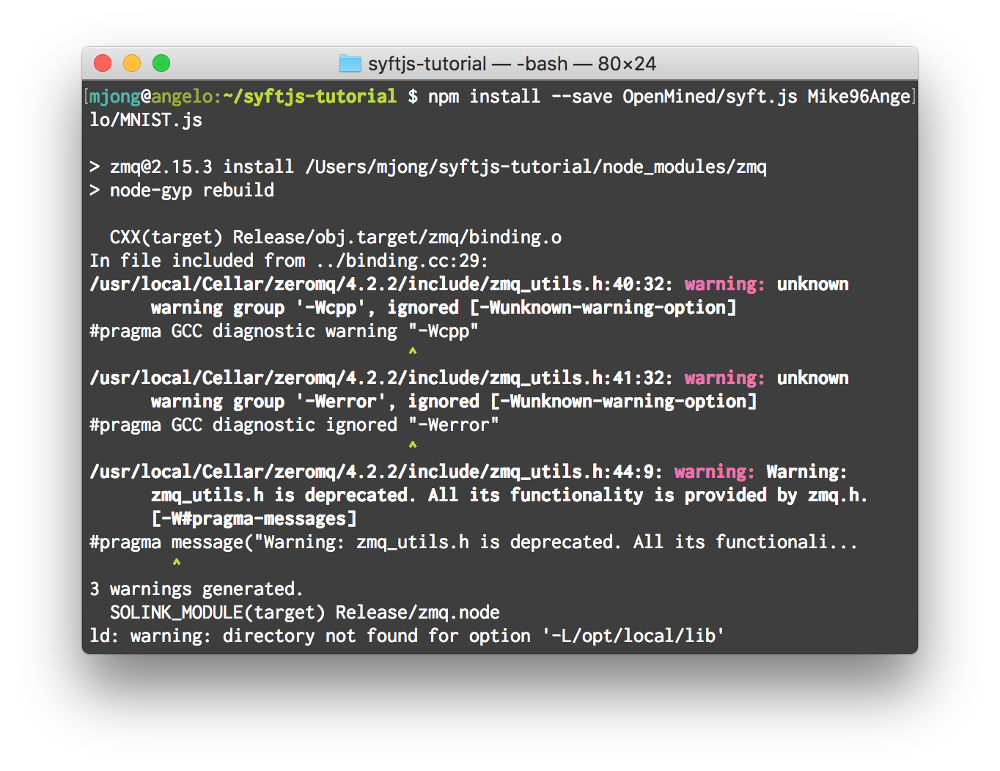
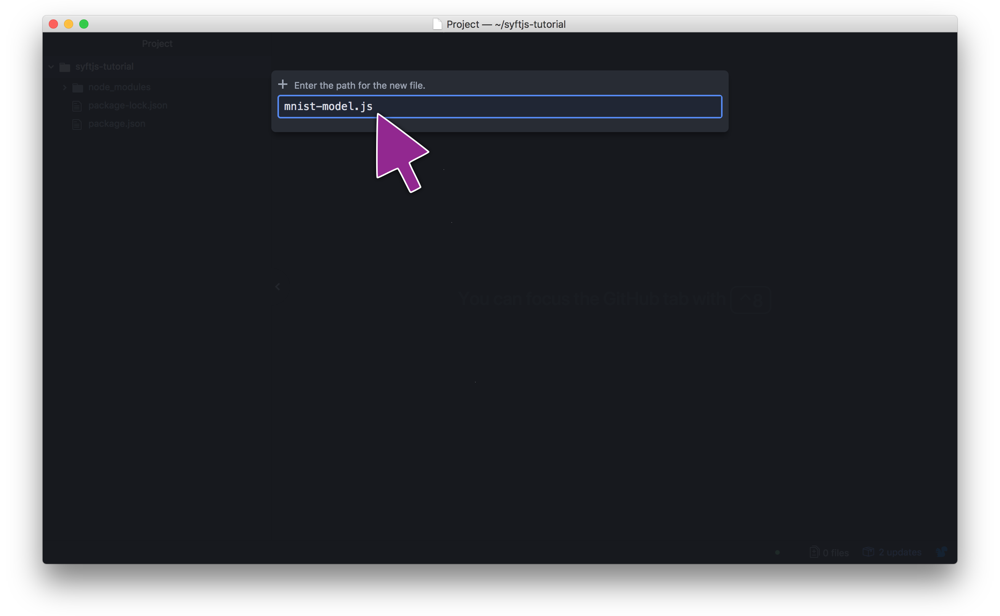
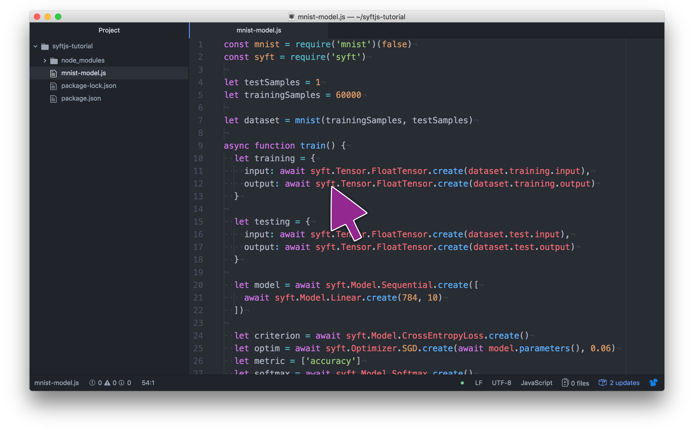
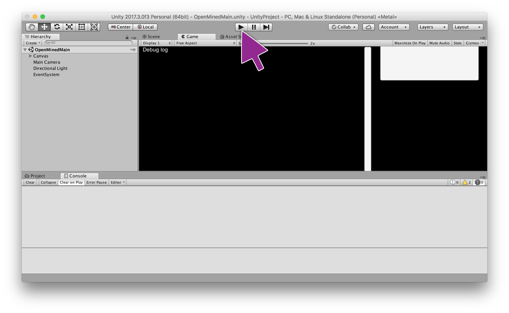
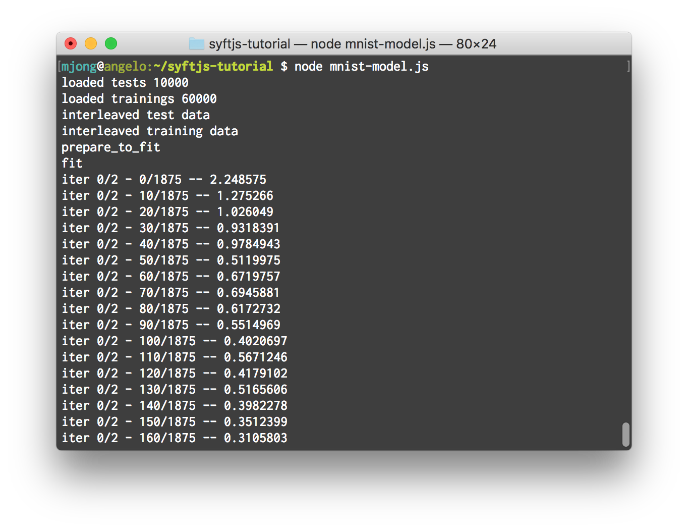
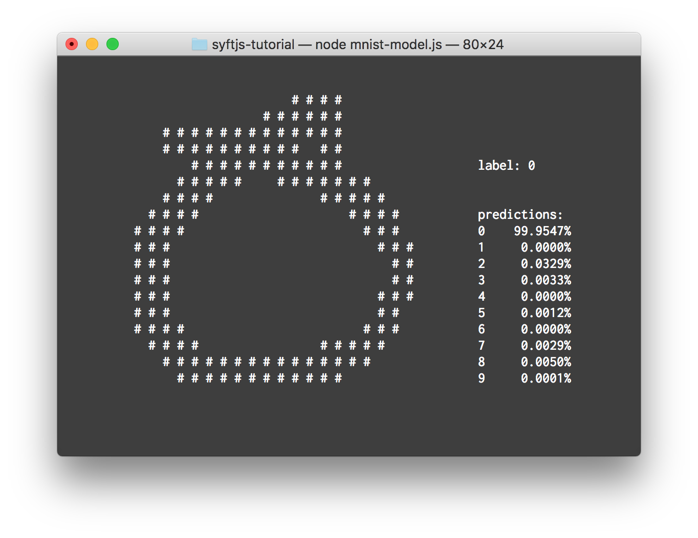

# Beginner Tutorial Syft.js
Syft.js is a JavaScript interface for creating and training models on the Open Mined backend.  In this tutorial we will go over how to get Syft.js up and running with a demo model, and train it on the MNIST dataset to predict handwritten digits.

## Prerequisites
If you have not yet installed the Open Mined backend, click the link bellow before continuing with this tutorial.  You will also have to install ZeroMQ.
 - [Install and setup the Open Mined backend](../../../installation/OpenMined)
 - [ZeroMQ](https://www.npmjs.com/package/zmq)


## Installing NodeJS
First you will need to install NodeJS v8 or higher (we have only tested on v8).  You can download NodeJS from https://nodejs.org.



## Setting Up a NodeJS Project with NPM
First open up a terminal window and make a new directory for your project.  We will make a new directory in our home directory called `syftjs-tutorial`.  Then navigate into the new directory you just made.

commands:
```
~ $ mkdir syftjs-tutorial
~ $ cd syftjs-tutorial
~/syftjs-tutorial $
```



Next we will use NPM to initialize our project.  NPM will ask a few questions in this step, you can answer them as you see fit.  We will just use the default answers.

commands:
```
~/syftjs-tutorial $ npm init
```


After we have initialize our project using NPM, we will install a few dependancies: Syft.js and MNIST.js which we will be using in this tutorial.

commands:
```
~/syftjs-tutorial $ npm install --save OpenMined/syft.js Mike96Angelo/MNIST.js
```


# Writing the Code
Now that we have everything installed that we need, we will open our project directory in our favourite text editor.  We will be using Atom in the tutorial.

To get started we will need to make a new file, we will call it `mnist-model.js`.



In our new file we will need to import the dependancies.

```JavaScript
const mnist = require('mnist')(false)
const syft = require('syft')
```

With `mnist` imported we can select our dataset.

```JavaScript
let testSamples = 10000
let trainingSamples = 60000

let dataset = mnist(trainingSamples, testSamples)
```

For convenience we will wrap our code in a async function scope, as the Syft.js has an async promise style API.  

```JavaScript
async function train() {
  // all async code will go in here
}
```

First we will need to pass our MNIST dataset to Syft.js by creating FloatTensors.

```JavaScript
  let training = {
    input: await syft.Tensor.FloatTensor.create(dataset.training.input),
    output: await syft.Tensor.FloatTensor.create(dataset.training.output)
  }

  let testing = {
    input: await syft.Tensor.FloatTensor.create(dataset.test.input),
    output: await syft.Tensor.FloatTensor.create(dataset.test.output)
  }
```

Next we can create a model that we can train using the MNIST dataset.

```JavaScript
  let model = await syft.Model.Sequential.create([
    await syft.Model.Linear.create(784, 10)
  ])
```

After we have a model, we can setup parameters for training.

```JavaScript
  let criterion = await syft.Model.CrossEntropyLoss.create()
  let optim = await syft.Optimizer.SGD.create(await model.parameters(), 0.06)
  let metric = ['accuracy']
  let softmax = await syft.Model.Softmax.create()
```

Now we can train our model with the following bit of code.

```JavaScript
  let loss = await model.fit(
    training.input,
    training.output,
    criterion,
    optim,
    32,     // batch size
    2,      // interactions
    1,      // log interval
    metric,
    true    // verbose
  )

  console.log('Trained with a final loss:', loss);
```

With our model all trained, we can use it to predict handwritten digits from our test set.  After we have a prediction we can draw a sample with the prediction and label to see how we did.

```JavaScript
  let perd = await softmax.forward(
    await model.forward(testing.input)
  )

  // select a random test example to draw
  let select = Math.floor(testSamples * Math.random())

  dataset.draw(
    (await testing.input.to_numpy()).slice(select * 784, (select + 1) * 784),
    (await perd.to_numpy()).slice(select * 10, (select + 1) * 10),
    (await testing.output.to_numpy()).slice(select * 10, (select + 1) * 10)
  )
```

With all that code in the async function scope we will then need to call it.

```JavaScript
train()
  .then(() => console.log('Done'))
  .catch((err) => console.log(err))
```



 - [click here for full code example](./mnist-model.js)

## Running the code!

First we will need to run the Open Mined backend by opening the OpenMined project in Unity and hitting play.



Then back in the Terminal window we will run our NodeJS app.

commands
```
~/syftjs-tutorial $ node mnist-model.js
```



Finally we have our result!


